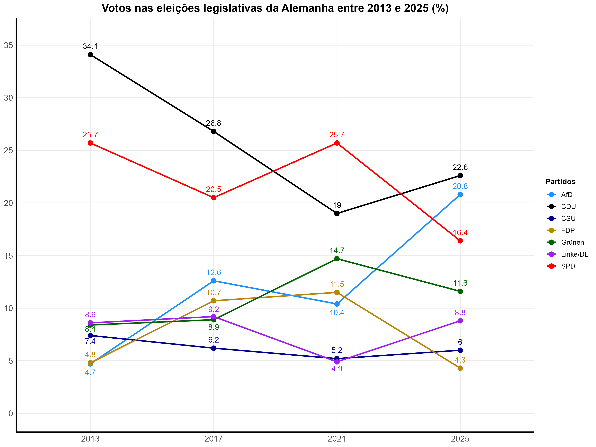
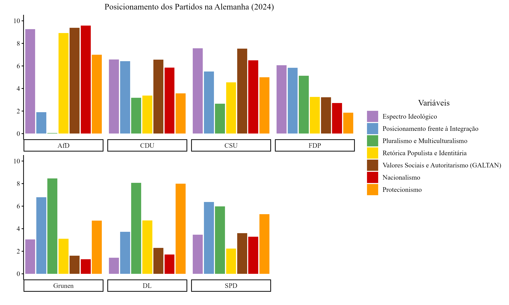
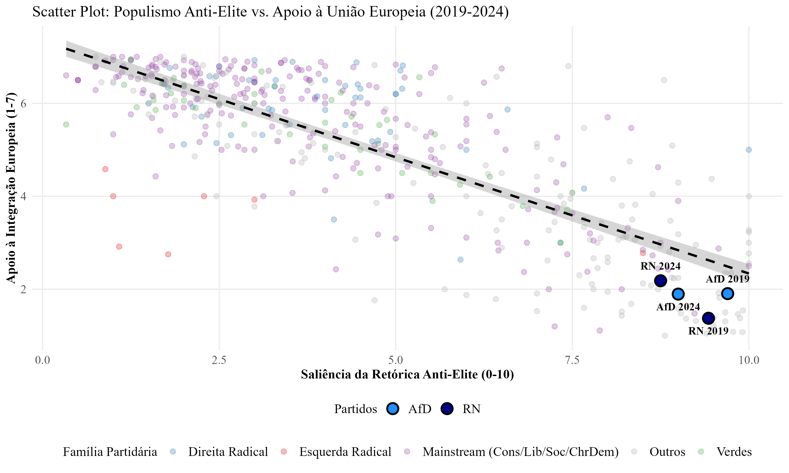
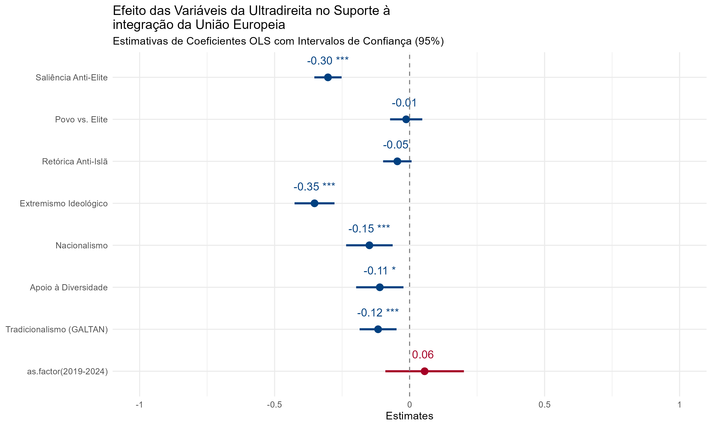

# 📊 Pesquisa Qualitativa-Quantitativa: Determinantes do Euroceticismo no Eixo Franco-Alemão

[](https://www.r-project.org/)
[](https://www.tidyverse.org/)
[]()

## 📌 Visão Geral do Projeto

Este repositório contém o desenvolvimento completo de uma solução analítica e estatística para mapear, quantificar e mensurar o impacto causal de variáveis político-ideológicas (como autoritarismo, nacionalismo e populismo) sobre o apoio partidário à integração da União Europeia. O projeto é fruto do Trabalho de Conclusão de Curso de Relações Internacionais e pode ser acessado através do [Repositório Institucional da UEPB: A (re)ascensão da ultradireita no eixo franco-alemão](https://repositorio.uepb.edu.br/items/2997a807-720a-4e0e-8d5b-5f969b5bec06).

O estudo de caso foca no motor macroeconômico e decisório europeu, o **Eixo Franco-Alemão**, analisando a evolução temporal e eleitoral dos partidos **Alternativa para a Alemanha (AfD), da Alemanha** e **Reagrupamento Nacional (RN), da França**, por meio do banco de dados Chapel Hill Expert Survey (CHES), disponibilizado por especialistas da área de integração regional e União Europeia.

> **💡 Abordagem Data Analytics:** Este projeto traduz um cenário geopolítico complexo em um modelo estatístico interpretável, utilizando engenharia de variáveis (Feature Engineering), análise exploratória de dados (EDA) e modelagem econométrica robusta (OLS) para extrair insights preditivos e quantificar relações de causa-efeito.

---

## 🛠️ Stack Tecnológica e Ferramentas

O pipeline de dados foi inteiramente construído utilizando a **Linguagem R**, priorizando a reprodutibilidade do código, eficiência na manipulação e rigor estatístico:

* **Ingestão e Manipulação de Dados:** `dplyr`, `tidyverse` (Feature Engineering e agregação de índices).
* **Modelagem Estatística:** `stats` (Estimação por Mínimos Quadrados Ordinários - OLS).
* **Diagnósticos e Correções:** `car` (Análise de Multicolinearidade - VIF), `lmtest` e `sandwich` (Correção de Heterocedasticidade com Erros-Padrão Robustos).
* **Visualização de Dados (Dataviz):** `ggplot2` (Gráficos de Dispersão e Séries), `sjPlot` (Plots de Coeficientes) e `stargazer` (Formatação de outputs analíticos).

---

## 🎲 O Dataset: Chapel Hill Expert Survey (CHES)

A base de dados utilizada provém do **CHES (1999-2024)**, uma referência global em Ciência Política que consolida o posicionamento de partidos europeus através de métricas quantificáveis de especialistas.

### 📐 Engenharia e Operacionalização de Variáveis (Feature Engineering)

Para viabilizar a modelagem, as métricas brutas do Codebook da CHES foram transformadas e agregadas em 7 eixos analíticos:

| Variável Analítica | Mapeamento Original (CHES) | Escala | Objetivo de Negócio |
| :--- | :--- | :--- | :--- |
| **Apoio à Integração (VD)** | `eu_position` | 1 (Mín) a 7 (Máx) | Variável Dependente. Mede o suporte ao bloco. |
| **Extremismo Ideológico** | Módulo de `Irgen` | `abs(Irgen - 5)` (0 a 5) | Captura de forma linear a distância do partido em relação ao centro político. |
| **Saliência Anti-Elite** | `antielite_salience` | 0 (Mín) a 10 (Máx) | Mensura o peso da retórica anti-establishment no ecossistema. |
| **Nacionalismo** | `nationalism` | 0 (Mín) a 10 (Máx) | Contrapõe discursos cosmopolitas a isolacionistas. |
| **Valores Sociais (GALTAN)**| `GALTAN` | 0 (Libertário) a 10 (Autoritário) | Mede a preferência por ordem e autoridade moral tradicional. |
| **Apoio à Diversidade** | Média de `immigrate_policy`, `multiculturalism`, `ethnic_minorities` | 0 a 10 (Escala invertida para alinhamento direcional) | Consolidação da dimensão de pluralismo sociocultural. |
| **Protecionismo** | `protecionism` | 0 (Livre Comércio) a 10 (Proteção) | Avalia a inclinação ao fechamento de mercados domésticos. |

---

## 📈 Pipeline de Análise de Dados (EDA e Insights)

### 1. Dinâmica Eleitoral e Fragmentação do Sistema Partidário Alemão
Como ponto de partida para a compreensão das transformações estruturais que tensionam a governabilidade da bloco, a análise histórica do comportamento do eleitorado alemão revela uma erosão consistente do espaço político outrora dominado pelas forças tradicionais do establishment.


*Gráfico 1: Votos nas eleições legislativas da Alemanha entre 2013 e 2025 (%)*

O mapeamento dos ciclos eleitorais entre 2013 e 2025 (Gráfico 1) elucida o avanço contínuo do AfD. Em sua estreia em 2013, o partido registrou 4,7% dos votos, desempenho insuficiente para superar a cláusula de barreira institucional de 5%, deixando o partido temporariamente sem representação no Parlamento Federal (Bundestag). No entanto, o AfD consolidou sua transição rumo à "quarta onda" da ultradireita, saltando para 12,6% dos votos em 2017.

Embora o pleito de 2021 tenha sinalizado uma sutil acomodação conjuntural (10,4%), o colapso da coalizão governista ao final de 2024 culminou no resultado histórico de 2025, em que o AfD ascendeu como a segunda maior força política nacional, atingindo 20,8% dos votos. Este crescimento fragiliza os partidos tradicionais: a União Democrata-Cristã (CDU), que atingira 34,1% em 2013, viu sua dominância recuar, enquanto o Partido Social-Democrata (SPD) declinou acentuadamente para 16,4% em 2025, evidenciando que o avanço reacionário e populista não se trata de um protesto eleitoral isolado, mas de uma variável estrutural na política interna do país.

### 2. O Perfil Ideológico da Ultradireita: O Caso Alemão em 2024
Para compreender as bases que sustentam o comportamento eleitoral observado, os dados extraídos junto aos especialistas da Chapel Hill Expert Survey (CHES) permitem mensurar os posicionamentos dos patidos políticos.


*Gráfico 2: Posicionamento dos Partidos na Alemanha (2024)*

Escolhendo apenas um dos gráficos, o resultado das variáveis analíticas do ano de 2024 (Gráfico 2) evidencia o isolamento do AfD em relação ao aos demais patidos do país. Enquanto os partidos do establishment (CDU, CSU, FDP e SPD) orbitam em patamares elevados de suporte geral ao projeto europeu - com índices de posicionamento frente à integração (`eu_position`) situados acima de 5,0 -, o AfD colapsa para a base mínima da escala.

Essa rejeição frontal ao modelo supranacional é indissociável do tripé ideológico que define a direita radical contemporânea: o partido registra pontuações próximos a 10,0 nas variáveis de Nacionalismo, Retórica Populista e Identitária, e inclinação a valores tradicionais e autoritários (Índice GALTAN). Nota-se ainda que o avanço do partido consolida uma transição relevante: o antigo viés liberal-conservador focado na Zona do Euro deu lugar a uma agenda assentada no Protecionismo econômico e na rejeição absoluta ao Pluralismo e Multiculturalismo (indicador próximo a zero), materializando o conceito de "chauvinismo de bem-estar", onde a proteção estatal deve ser restrita estritamente aos nativos.

### 3. A Simbiose Populista: Saliência Anti-Elite e Suporte ao Bloco
Aprofundando o nível de análise para o plano comparado do eixo motor da integração, o cruzamento das variáveis revela padrões comportamentais simétricos entre as forças reacionárias da França e da Alemanha.


*Gráfico 3: Scatter Plot: Populismo Anti-Elite vs. Apoio à União Europeia (2019-2024)* 

O gráfico de dispersão (Gráfico 3) demonstra uma correlação linear estritamente negativa entre o grau de importância conferido ao discurso anti-establishment e o suporte ao ecossistema institucional de Bruxelas. A linha de tendência descendente ilustra que a instrumentalização da desconfiança age de forma inversamente proporcional à aceitação da legitimidade supranacional.

O aspecto analítico mais contundente repousa na localização geográfica das observações do AfD e do RN nos ciclos de 2019 e 2024. Ambos os partidos situam-se de forma agrupada como outliers no quadrante inferior direito. A saturação de suas retóricas populistas (escalas superiores a 8,5) empurra o posicionamento de liderança em relação à UE para os patamares de rejeição mais severos da amostra. O padrão gráfico confirma a tese de que a narrativa de "irrealidade" e o maniqueísmo que divide o discurso entre o "povo puro" e a "elite globalista corrupta" servem como o principal combustível ideológico para justificar a agenda de "soberanismo integral" promovida por Marine Le Pen e pela cúpula do AfD.

---

## 🔬 Modelagem Econométrica e Validação

Visando isolar os efeitos distributivos e conferir robustez metodológica às inferências qualitativas, formulou-se um modelo econométrico de Regressão Linear Múltipla estimado por Mínimos Quadrados Ordinários (OLS), baseado em $487$ observações amostrais:

$$Y_{apoio} = \beta_0 + \beta_1 X_{populismo} + \beta_2 X_{ideologia} + \beta_3 X_{nacionalismo} + \beta_4 X_{diversidade} + \beta_5 X_{galtan} + \epsilon_i$$


*Gráfico 4: Coefficient Plot: Determinantes do apoio à integração da UE (2019-2024)* 

### 📊 Resultados do Modelo

O modelo demonstrou um **$R^2$ Ajustado de 0.772**, indicando que as variáveis selecionadas possuem um altíssimo poder preditivo, **explicando 77,2% da variação** do euroceticismo na Europa.

* **Extremismo Ideológico ($\beta = -0.352^{***}$):** O preditor mais forte. Cada ponto de afastamento do centro político reduz o apoio à integração em 0.35 pontos na escala. Validação matemática do formato de ferradura (convergência de comportamento nos extremos).

* **Saliência Anti-Elite ($\beta = -0.302^{***}$):** Segundo maior vetor. A estratégia de marketing político focada na polarização ("povo puro" vs "elite corrupta de Bruxelas") possui impacto causal direto e negativo na estabilidade da marca institucional da UE.

* **As variáveis de Nacionalismo ($\beta = -0,149; p < 0,01$)** e **Tradicionalismo/GALTAN ($\beta = -0,117; p < 0,01$)** denotam que o euroceticismo contemporâneo é profundamente tracionado por uma reação cultural de caráter autoritário e comunitarista frente ao cosmopolitismo liberal europeu.

* **Variável de Controle Temporal (`as.factor`):** Não apresentou significância estatística. **Insight:** O desgaste do ecossistema europeu não é um efeito temporal passageiro ou sazonal, mas sim uma consequência direta da mudança estrutural na distribuição das forças partidárias domésticas.

### 🛡️ Diagnóstico de Qualidade do Modelo
1.  **Multicolinearidade:** Submetido ao teste de Fator de Inflação da Variância (VIF) pelo pacote `car`, garantindo que a alta correlação teórica entre Nacionalismo e GALTAN não enviesasse os estimadores.
2.  **Heterocedasticidade:** Corrigida através da aplicação de erros-padrão robustos (`lmtest` e `sandwich`), assegurando que a variabilidade residual inconstante não invalidasse as inferências e os intervalos de confiança ($95\%$).

---

## 🎯 Conclusão e Aplicação Prática

Do ponto de vista de **analítico**, os resultados indicam um cenário de travamento operacional e perda de eficiência no eixo motor da Europa. 

Historicamente, o dinamismo e a pacificação da Europa orbitaram em torno da capacidade do **Eixo Franco-Alemão** de coordenar propósitos nacionais, mitigar custos de transação e liderar a cessão coordenada de soberania. O paradoxo contemporâneo demonstrado por este estudo reside no fato de que a consolidação eleitoral do **Reagrupamento Nacional (RN)** na França (125 assentos em 2024) e da **Alternativa para a Alemanha (AfD)** (recorde de 152 cadeiras em 2025) asfixiou esse motor político.  

Ao converter o tradicional ceticismo integracionista em uma plataforma de **"soberanismo integral"**, essas forças reacionárias deixaram de atuar apenas como partidos de protesto isolados para se tornarem atores institucionais com poder de veto estrutural.  

Como implicação prática, observa-se um cenário de **travamento operacional e desequilíbrio na governabilidade supranacional**. Pressionados pelo avanço do "chauvinismo de bem-estar" no nível doméstico, os partidos do mainstream tradicional encontram-se constrangidos a mimetizar posturas defensivas e protecionistas para conter a perda de eleitorado. Esse movimento fragmenta o "Consenso de Bruxelas", inviabiliza o aprofundamento de tratados integracionistas e tensiona o modelo sui generis da União Europeia frente à resiliência de suas instituições históricas.  

**A (re)ascensão da ultradireita no eixo franco-alemão prova, por meio dos dados, que o enfraquecimento do regionalismo europeu é o resultado direto do colapso da representatividade e do consenso partidário interno de seus próprios estados fundadores.**

---

## 📜 Fonte dos Dados e Publicação

Os dados quantitativos utilizados nesta solução analítica provêm de bases públicas de especialistas em integração regional e dinâmicas político-partidárias europeias:

*   [Chapel Hill Expert Survey (CHES)](https://www.chesdata.eu/ches-europe) - Dataset abrangendo o posicionamento de lideranças partidárias no ecossistema da União Europeia.
*   Dados institucionais de performance macroeleitoral agregados e extraídos diretamente das bases oficiais do *Die Bundeswahlleiterin* (Alemanha) e do *Ministère de l'Intérieur* (França).

O trabalho acadêmico completo está disponível no repositório da UEPB:

[](https://repositorio.uepb.edu.br/items/2997a807-720a-4e0e-8d5b-5f969b5bec06)

---

## 👨‍💻 Autor

**Pedro Solon Assis Ramelli**
<br>Graduado em Relações Internacionais - Universidade Estadual da Paraíba (UEPB)

[](https://www.linkedin.com/in/pedrosolonassis/)
[](mailto:solonpedro21@gmail.com)


## 📁 Estrutura do Repositório
```text
PROJETO_TCC/
│
├── codebook/
│   ├── 1999-2019_CHES_codebook.pdf
│   ├── 1999-2024_CHES_codebook.pdf
│   ├── 2019_CHES_codebook.pdf
│   └── CHES+2024+Codebook.pdf
│
├── data/
│   ├── .RData
│   ├── 1999-2024_data.csv
│   ├── CHES_2024_final_v2.csv
│   ├── dados_reg.csv
│   ├── data_2019.csv / data_2024.csv
│   ├── Expert Survey.csv
│   ├── ale_2014.xlsx / ale_2019.xlsx
│   ├── ale_2024 2025.xlsx
│   └── fra_2014.xlsx / fra_2019.xlsx
│   └── fra_2019_2014.xlsx / fra_2024 2022.xlsx
│
├── outputs/
│   └── figures/
│       ├── ale2014.png
│       ├── ale2019.png
│       ├── ale2024.png
│       ├── Assentos Alemanha.png
│       ├── Assentos França (2012-2017).png
│       ├── Assentos França (2022-2024).png 
│       ├── fra2014.png
│       ├── fra2019.png
│       ├── fra2024.png 
│       ├── grafico_barras_ale_2024.png
│       ├── grafico_eleicoes_alemanha.png
│       ├── grafico_regressao.png
│       ├── grafico_scatter.png
│       ├── grafico_ue_tcc.png
│       ├── spec_ue.png
│       ├── tabela_regressao_tcc.png
│       ├── votos_franca_12_17.png
│       └── votos_franca_22_24.png
│
├── dados_eleicoes/
│   ├── eleicoes_alemanha.R
│   └── eleicoes_frança.R
│
├── posicao_partidos/
│   ├── graficos_partidos_ue_2014.R
│   ├── graficos_partidos_ue_2019.R
│   └── graficos_partidos_ue_2024.R
│
├── posicao_ue/
│   └── grafico_ue.R
│
├── regressao_graficos/
│   ├── regressao.R
│   ├── coefficient.R
│   └── scatter.R
│
├── .gitignore
└── README.md
\```
